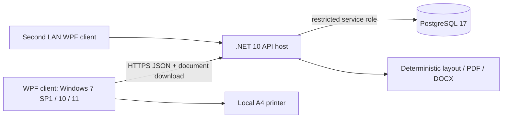

# Architecture proposal and implementation contract

## Known / researched / pending / software decisions

* Known: one center, one or two report writers, offline operation, separate documents per investigation, manual results, corrections, physical A4 letterhead, PDF primary and DOCX secondary.
* Researched: .NET Framework 4.8 installation compatibility includes Windows 7 SP1; modern .NET server support differs. WHO LQMS and NRCeS DiagnosticReport concepts support traceable records and atomic observations. See source register.
* Medical validation pending: actual test menu, method/specimen requirements, units, reference interval provenance and applicability, mandatory clinical fields, authorization practice, technician/doctor attribution and sample conflicts.
* Software decisions: WPF/net48 client compatibility spike, .NET 10 LTS application host, PostgreSQL 17 supported major (latest maintenance patch at installation), versioned JSON schema definitions plus relational result rows, immutable revision chains, server-side rendering. Client runtime choice is provisional until the compatibility spike passes.

## Deployment

On a compatible modern Windows PC the client, host and database may coexist. A Windows 7 client can use a modern host over an isolated LAN. A current, supported all-in-one Windows 7 stack has **not** been established: do not install an obsolete database/runtime as an implicit workaround. Verify the actual first-install OS before deployment. Docker is a developer test convenience, not a Windows 7 deployment dependency.

## Boundaries

Domain has no database, WPF or PDF dependencies. Application orchestrates validations and exposes repository/rendering interfaces. Infrastructure implements transactional PostgreSQL persistence. API maps authenticated requests to use cases. Desktop uses HTTP only; it has no database credentials. Rendering consumes a frozen revision and its exact template/doctor versions.

The case is a lightweight grouping, not a billing order. A case may contain independently revised CBC, LFT, urine, histopathology and ECG reports; no automatic merged report exists.

## Integrity rules

1. Every save appends a complete structured revision. The expected revision number is mandatory; stale saves fail with HTTP 409.
2. Results belong to revision-specific sections and cells, not to mutable current report fields. Patient/referrer/specimen/history/report time/attribution/formatting snapshots are retained with each revision.
3. Template and doctor/signature versions are append-only. Historical rendering resolves explicit version IDs, never "latest".
4. Draft schema configurations may be saved and previewed only with a conspicuous DRAFT marker. Issue requires documented clinical approval, actual selected attribution and a separate issue action. Selecting a doctor does not assert that the doctor personally reviewed the report.
5. Number allocation, report creation, revision insertion and audit insertion occur in one transaction. Year counters are row-locked/atomic; public identifiers are not row IDs.
6. Generated PDF/DOCX bytes, hashes, engine identity, page plan and revision linkage are retained in PostgreSQL. A failed render cannot erase a saved revision.
7. Retry-sensitive create requests carry client operation UUIDs. Reusing the same UUID returns the existing case/report rather than duplicating it.
8. Archives/expiry are states. Retention never triggers automatic deletion.

## Recovery

Database transactions protect committed revisions from application interruption. Saving precedes generating/printing. No clinical data is logged in error logs. Render failures are reported with a correlation ID and can be retried against the same immutable revision. Print spool submission is not proof of physical printing; printer failure and reprint handling must be accepted on hardware.

## Future seams

UUIDs, UTC instants with India-local display, stable local field codes, optional future terminology bindings, transport contracts and separate host permit later Android/sync/branch integration. FHIR/ABDM, analyzers, portals, billing, inventory, messaging, DICOM/PACS and cloud are explicitly outside this implementation. Do not add speculative synchronization infrastructure.
