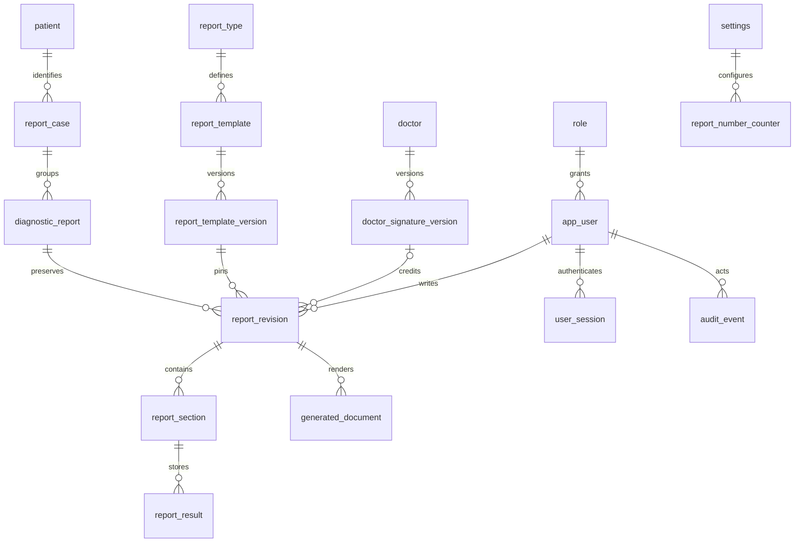

# Relational schema and ERD

The executable authority is `database/migrations/001_initial.sql`. Definitions are versioned JSON documents, but **clinical values are individual relational rows**. Tables/structured groups are represented by field code, group key and row index; there is no whole-report HTML/text storage model.

* `patient`: minimal metadata created for the case, no matching/history service.
* `report_case`: patient link, case UUID, client operation UUID, created actor/time.
* `diagnostic_report`: case/type, unique configurable public number, current revision pointer, retention state.
* `report_template_version`: stable version UUID, content hash, schema/layout JSON, review evidence, reviewer and approval time. Approval is immutable; approval creates a new approved version rather than changing an existing draft definition.
* `doctor_signature_version`: frozen display name, qualification/designation/registration/specialty and bounded PNG assets; no fake seeded doctors.
* `report_revision`: linear revision/previous-revision linkage; frozen metadata JSON (patient header, not results), selected doctor version, formatting JSON, issue state, reason, changed paths, actor/time.
* `report_section`: schema code and frozen visible state for a revision.
* `report_result`: field code, row/group coordinates, value kind, numeric/text/coded value, frozen unit/reference text. SQL enforces shape and coordinates; the schema validator enforces clinical-configuration structure.
* `generated_document`: protected database bytes, SHA-256, revision, format, page count and engine version. A bytes/hash mismatch is an integrity failure.
* `app_user`, `role`, `user_session`: password hashes, role codes, lockouts, hashed opaque bearer tokens, idle/absolute expiry and revocation.
* `audit_event`: actor/action/entity/revision/time; excludes result values, patient names and raw passwords/tokens.
* `settings`: center display name, numbering prefix and retention days. Layout offsets are pinned template data.

Migration and application roles are separate. Revisions/results/versions/documents/audits cannot be updated or deleted by the application role. The current pointer and lifecycle fields are the only mutable report state. Restore is an administrative operation, not a report-writer feature.
